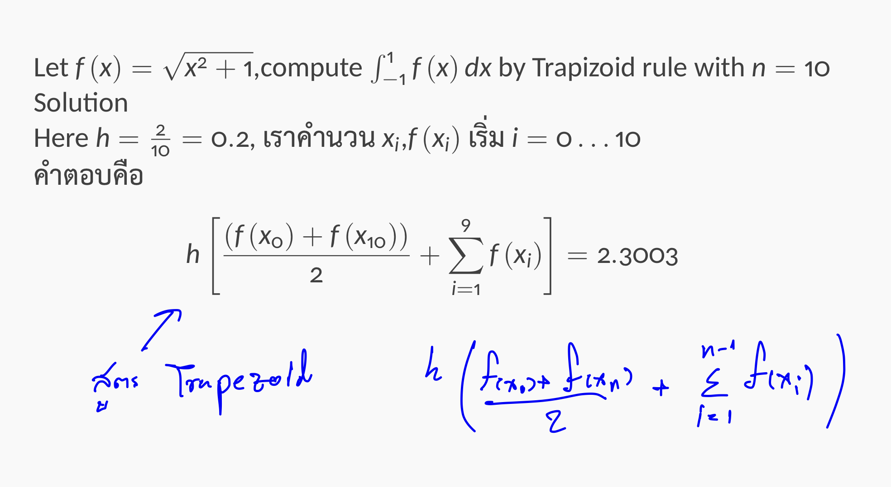
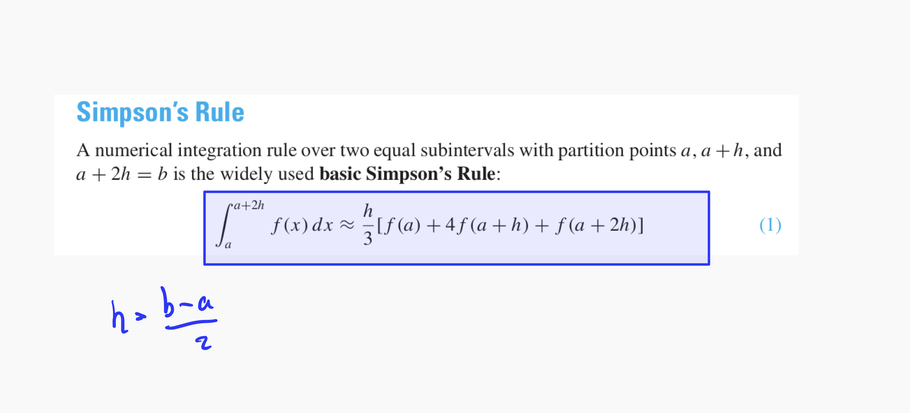

# Topic

_Method find Integral of function f(x) from a to b_

- Trapezoid rule
- Romberg integration
- Simpson's rule
- Adaptive Simpson's rule

# Trapezoid rule

# Romberg integration

# Simpson's rule

